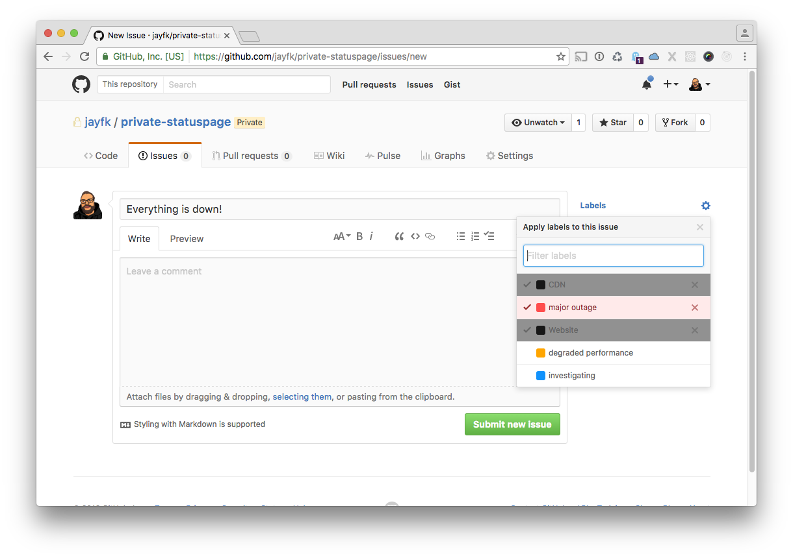

# Statuspage

A statuspage generator that lets you host your statuspage for free on GitHub. Uses 
issues to display incidents and labels for severity. 

## Demo

See a real status page generated by this at [status.pyup.io](http://status.pyup.io/) or a [demo site](https://jayfk.github.io/statuspage-demo/)

## Quickstart

Install statuspage with pip:

    pip install statuspage

*There are also binaries for macOS and Linux available, see [installation](docs/installation.md) for more.*

Now, create an GitHub API token:

- Go to your [Personal Access tokens](https://github.com/settings/tokens) page.
- Click on `Generate new token`. 
- Make sure to check the `public_repo` and `write:repo_hook` scope. 
- Copy the token somewhere safe, you won't be able to see it again once you leave the page.

To create a new status page, run:

    statuspage create --token=<yourtoken>
    
You'll be prompted for a repo name and the systems you want to show a status for.

    Name: mystatuspage
    Systems, eg (Website,API): Website, CDN, API
    
*Please note: This will generate a new repo under that name. Make sure it doesn't exist already.*
    
The command takes a couple of seconds to run. Once ready, it will output links to the issue tracker and your new status page.

    Create new issues at https://github.com/<login>/mystatuspage/issues
    Visit your new status page at https://<login>.github.com/mystatuspage/

Next, you will be asked if you want to automate the update process, so that you don't have to run
the `statuspage update` command whenever you change anything on your repo. 

    Set up automation? [y/N]: y

If you want use the service, choose `y` and grab a key at the [shop](https://www.statuspage-backend.com). 

If you don't want to use the service, choose `n`. The generator will then print the `statuspage update`
command filled with all the details you need to update your page.
     
## Create an issue

To create a new issue, go to your newly created repo and click on `New Issue`.

- Click on the cog icon next to labels on the right. 
- Choose the affected systems (black labels)
- Choose a severity label (major outage, degraded performance, investigating)
- Fill in the title, leave a comment and click on `Submit new issue`.

Now, update your status page. Go back to your commandline and type:

    statuspage update --token=<yourtoken>
    Name: mystatuspage

If you change the issue (eg. when you add a new label, create a comment or close the issue), you'll
need to run `statuspage update` again.

## Customizing
See [customizing](docs/customizing.md)

## Options
See [options](docs/options.md)
